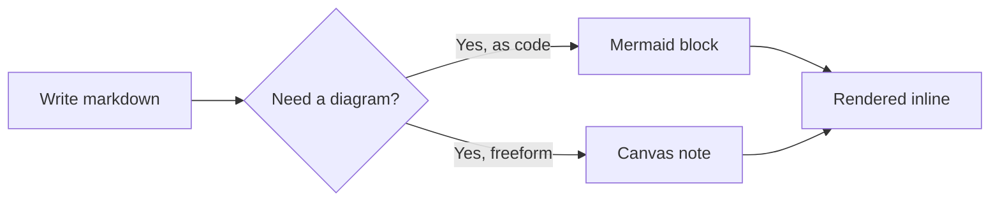

← Back to [[tutorial|Tutorial]]

## Diagrams as code: Mermaid

Fence a code block with `mermaid` as the language and switch to **Preview** (or **Split**) to see it rendered:

Mermaid also does sequence diagrams, ER diagrams, and more — same idea, different keyword after the fence.

## Freeform diagrams: Canvas notes

For sketching rather than describing, click **+ Canvas** in the sidebar. That creates a note with `type: canvas` in its frontmatter (see [[tutorial/properties|Properties & types]]), which switches the whole note into an Excalidraw whiteboard — shapes, arrows, freehand drawing, text. It's saved as JSON in the note body, syncing through the exact same real-time channel as text notes.

Next: [[tutorial/citations|Citations & references →]]
